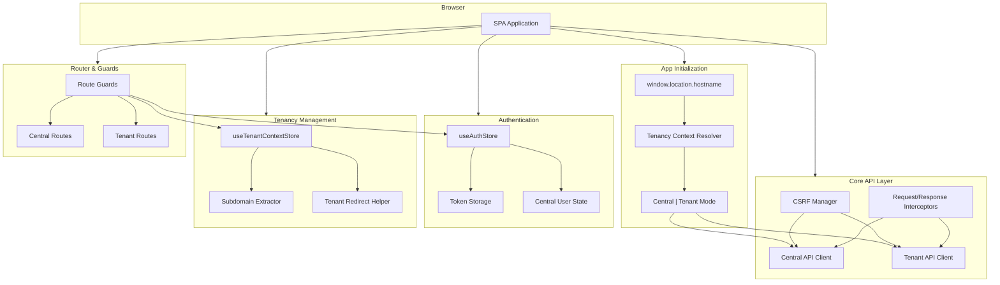

# План реализации: Core Architecture & Multitenancy

## Цель

Создать фундаментальный слой приложения, который корректно обрабатывает:

- Разделение Central и Tenant контекстов на основе subdomain
- Аутентификацию через Laravel Sanctum (CSRF + Bearer token)
- Динамическое определение API base URL в зависимости от контекста
- Router guards для защиты маршрутов
- Базовые stores для управления состоянием

## Архитектурная диаграмма

## Этап 1: Настройка окружения и зависимостей

### 1.1 Установка зависимостей

- Установить `axios` для HTTP клиента
- Установить `@vueuse/core` (опционально, для утилит)

### 1.2 Создание файлов окружения

Создать `.env` и `.env.example` с переменными:

- `VITE_APP_ENV` (local | staging | prod)
- `VITE_API_SCHEME` (http | https)
- `VITE_API_PORT` (например, 8000)
- `VITE_API_PATH_PREFIX` (/v1)
- `VITE_CENTRAL_HOST` (опционально, для центрального домена)
- `VITE_CENTRAL_DOMAINS` (список центральных доменов через запятую)

## Этап 2: Core API Layer

### 2.1 Типы и интерфейсы

**Файл:** `src/core/api/types.ts`

- `ApiResponse<T>` - обертка для успешных ответов
- `ApiError` - тип для ошибок API
- `PaginatorMeta` - метаданные пагинации

### 2.2 CSRF Manager

**Файл:** `src/core/auth/csrf.ts`

- Функция `fetchCsrfCookie()` - получение CSRF cookie перед первым запросом
- Функция `getCsrfToken()` - извлечение XSRF-TOKEN из cookies
- Обработка ошибки 419 с автоматическим refresh CSRF

### 2.3 Token Storage

**Файл:** `src/core/auth/token.ts`

- Функции для сохранения/получения/удаления токена из localStorage
- Типизированные методы с проверкой наличия токена

### 2.4 Tenancy Context Resolver

**Файл:** `src/core/tenancy/resolver.ts`

- Функция `extractSubdomain(hostname: string): string | null` - извлечение subdomain
- Функция `isCentralHost(hostname: string): boolean` - проверка центрального домена
- Функция `getTenantSubdomain(): string | null` - получение текущего subdomain

**Файл:** `src/core/tenancy/context.ts`

- Тип `AppMode` ('central' | 'tenant')
- Функция `getAppMode(): AppMode` - определение режима приложения
- Функция `getApiBaseUrl(mode: AppMode): string` - формирование base URL

**Файл:** `src/core/tenancy/redirect.ts`

- Функция `buildTenantUrl(subdomain: string, path?: string): string` - построение URL для tenant
- Функция `redirectToTenant(subdomain: string, path?: string): void` - hard redirect

### 2.5 API Client Base

**Файл:** `src/core/api/client.ts`

- Базовый класс/функция для создания axios instance
- Настройка interceptors:
- Request: добавление Authorization header, X-XSRF-TOKEN, Accept, Content-Type
- Response: парсинг envelope, обработка ошибок
- Обработка специфичных ошибок:
- 401 → очистка auth state, redirect на login
- 419 → refresh CSRF и retry запроса
- 403, 422, 429, 5xx → проброс с типизацией

### 2.6 Central и Tenant API Clients

**Файл:** `src/core/api/central.ts`

- Экспорт `centralApi` - axios instance для central endpoints
- Base URL формируется на основе `VITE_CENTRAL_HOST` или текущего hostname

**Файл:** `src/core/api/tenant.ts`

- Экспорт `tenantApi` - axios instance для tenant endpoints
- Base URL всегда = текущий hostname (tenant subdomain)

**Файл:** `src/core/api/index.ts`

- Реэкспорт обоих клиентов
- Helper функция `getApiClient(mode: AppMode)` для получения нужного клиента

## Этап 3: Stores (Core)

### 3.1 Auth Store

**Файл:** `src/stores/core/auth.ts`

- State:
- `token: string | null`
- `centralUser: CentralUser | null`
- `isReady: boolean`
- Actions:
- `login(credentials)` - вызов `/v1/users/auth/login`, сохранение token и user
- `register(data)` - вызов `/v1/users/auth/register`
- `logout()` - вызов `/v1/users/auth/logout`, очистка state
- `fetchMe()` - загрузка `/v1/users/me/central` для проверки аутентификации
- `hydrateFromStorage()` - восстановление из localStorage при старте
- Getters:
- `isAuthenticated` - computed на основе наличия token и centralUser

### 3.2 Tenant Context Store

**Файл:** `src/stores/core/tenant-context.ts`

- State:
- `selectedTenant: { id: number; title: string; domain: string } | null`
- `centralDomain: string` (из env)
- Getters:
- `tenantSubdomain()` - computed из `window.location.hostname`
- `isTenantHost()` - computed проверка tenant режима
- `currentMode()` - computed ('central' | 'tenant')
- Actions:
- `setTenantFromTenantsList(tenant)` - установка выбранного tenant
- `resetTenantContext()` - сброс при logout
- `redirectToTenant(subdomain, path?)` - helper для redirect

### 3.3 UI Store (базовый)

**Файл:** `src/stores/core/ui.ts`

- State для toasts, dialogs, loading states
- Базовые actions для показа/скрытия UI элементов

## Этап 4: Router & Guards

### 4.1 Route Definitions

**Файл:** `src/router/central.ts`

- Central routes:
- `/login` - LoginView
- `/register` - RegisterView
- `/forgot-password` - ForgotPasswordView
- `/reset-password` - ResetPasswordView
- `/tenants` - TenantListView
- `/tenants/select` - TenantSelectView
- `/invite/:token` - InvitationView

**Файл:** `src/router/tenant.ts`

- Tenant routes:
- `/app` - DashboardView (layout с sidebar)
- `/app/projects` - ProjectsListView
- `/app/projects/:id` - ProjectDetailView
- `/app/websites` - WebsitesListView
- `/app/checks` - ChecksListView
- `/app/reports` - ReportsListView
- `/app/notifications` - NotificationsView
- `/app/settings/profile` - ProfileSettingsView

### 4.2 Router Guards

**Файл:** `src/router/guards.ts`

- `requiresAuth(to, from, next)`:
- Проверка наличия token
- Если нет → redirect на `/login`
- Если есть → вызов `authStore.fetchMe()` для проверки валидности
- `requiresTenant(to, from, next)`:
- Проверка `tenantContextStore.isTenantHost`
- Если не tenant host → redirect на `/tenants/select`
- Дополнительно: проверка `/v1/users/me` для валидации tenant user mapping
- `requiresCentral(to, from, next)`:
- Проверка что НЕ tenant host
- Если tenant host → redirect на `/app` (или показать ошибку)

### 4.3 Router Setup

**Файл:** `src/router/index.ts`

- Объединение central и tenant routes
- Настройка `beforeEach` guard с применением соответствующих guards
- Meta поля для маршрутов: `{ requiresAuth, requiresTenant, requiresCentral }`

## Этап 5: App Bootstrap

### 5.1 Main Entry Point

**Файл:** `src/main.ts`

- Инициализация Pinia
- Инициализация Router
- Вызов `authStore.hydrateFromStorage()` для восстановления сессии
- Определение режима приложения (central/tenant) при старте
- Обработка начального redirect если необходимо

### 5.2 App Component

**Файл:** `src/App.vue`

- Router-view
- Базовый layout wrapper (опционально)

## Этап 6: Базовые Views (заглушки)

### 6.1 Central Views

- `src/views/LoginView.vue` - форма логина
- `src/views/RegisterView.vue` - форма регистрации
- `src/views/TenantSelectView.vue` - список tenants с выбором

### 6.2 Tenant Views

- `src/views/TenantLayout.vue` - layout с sidebar/navbar для tenant режима
- `src/views/DashboardView.vue` - dashboard (заглушка)

## Критические моменты реализации

1. **CSRF Cookie**: Первый запрос должен быть `GET /sanctum/csrf-cookie` перед любым stateful запросом
2. **Tenant Detection**: Backend определяет tenant ТОЛЬКО по Host header, поэтому все tenant запросы должны идти на tenant subdomain
3. **Token Storage**: Использовать localStorage для token, но помнить о безопасности (XSS)
4. **Error Handling**: Централизованная обработка ошибок в interceptors
5. **Mode Switching**: При переключении tenant - hard redirect (не router.push), чтобы изменить hostname

## Тестирование

После реализации проверить:

- [ ] Определение central/tenant режима по hostname
- [ ] CSRF cookie получение перед login
- [ ] Login flow с сохранением token
- [ ] Redirect на tenant subdomain при выборе workspace
- [ ] Tenant API calls идут на правильный host