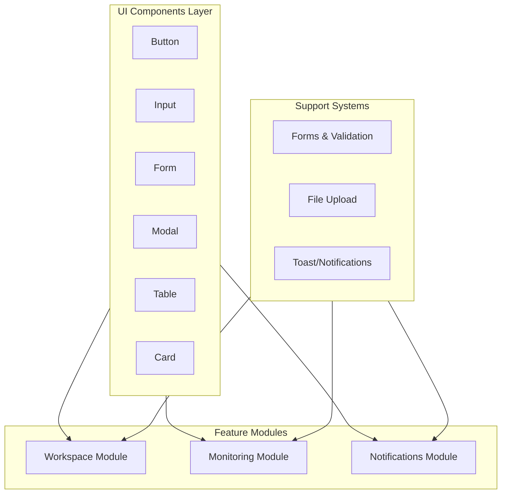

# План реализации: Feature Modules Implementation

## Обзор

После завершения core архитектуры необходимо реализовать функциональные модули приложения. План включает создание UI компонентов, feature-модулей (Workspace, Monitoring, Notifications) и вспомогательных систем (формы, валидация, загрузка файлов).

## Прогресс реализации

### ✅ Завершено

1. **UI Components Library** - все базовые и продвинутые компоненты реализованы
2. **Forms & Validation** - система форм, валидации и FormField компонент
3. **File Upload** - компонент загрузки файлов с drag & drop
4. **Tenant Management & Selection** - полностью реализовано:

- Tenants store с CRUD операциями
- TenantForm для создания/редактирования
- TenantSelectView с выбором и созданием тенантов
- TenantListView для центрального режима
- Redirect helpers для навигации между доменами
- InvitationView для принятия приглашений

5. **Workspace Module** - полностью реализовано:

- Типы и интерфейсы
- Stores для clients, directories, websites, pages
- Views и компоненты (ProjectsList, ProjectDetail, WebsitesList, DirectoryTree, PagesList)

6. **UI Store Extension** - расширен для toast, modals, loading states
7. **Monitoring Module** - полностью реализовано:

- Типы и интерфейсы ✅
- Stores (checkers, checks, reports) ✅
- Views и компоненты (ChecksListView, CheckForm, CheckConfigForm, ReportsListView, ReportDetails) ✅

### 🔄 В процессе / Ожидает реализации

1. **Notifications Module** - не начато:

- Типы и интерфейсы
- Stores (notifications, preferences, telegram)
- Views и компоненты

3. **Dashboard Integration** - placeholder реализован, требуется доработка
4. **Profile Settings** - placeholder реализован, требуется доработка
5. **Error Handling** - централизованная обработка ошибок не реализована

## Архитектура модулей

## Этап 1: UI Components Library

### 1.1 Базовые компоненты

**Файл:** `src/shared/ui/Button.vue`

- Варианты: primary, secondary, danger, ghost
- Размеры: sm, md, lg
- Состояния: loading, disabled
- Слоты: default, icon

**Файл:** `src/shared/ui/Input.vue`

- Типы: text, email, password, number, textarea
- Состояния: error, disabled
- Валидация: показ ошибок
- Иконки: prefix, suffix

**Файл:** `src/shared/ui/Select.vue`

- Одиночный и множественный выбор
- Поиск (опционально)
- Группировка опций

**Файл:** `src/shared/ui/Checkbox.vue` и `src/shared/ui/Radio.vue`

- Базовые компоненты для форм

**Файл:** `src/shared/ui/Card.vue`

- Заголовок, контент, футер
- Варианты стилей

**Файл:** `src/shared/ui/Modal.vue`

- Открытие/закрытие
- Размеры: sm, md, lg, xl
- Слоты: header, body, footer
- Закрытие по клику вне модалки

**Файл:** `src/shared/ui/Table.vue`

- Колонки с настройкой
- Сортировка
- Пагинация (интеграция)
- Пустое состояние

**Файл:** `src/shared/ui/Badge.vue`

- Варианты цветов
- Размеры

**Файл:** `src/shared/ui/Spinner.vue`

- Индикатор загрузки

**Файл:** `src/shared/ui/Toast.vue` и `src/shared/composables/useToast.ts`

- Типы: success, error, warning, info
- Автоматическое скрытие
- Позиционирование

### 1.2 Layout компоненты

**Файл:** `src/shared/ui/Container.vue`

- Ограничение ширины контента

**Файл:** `src/shared/ui/PageHeader.vue`

- Заголовок страницы с действиями

## Этап 2: Forms & Validation

### 2.1 Система валидации

**Файл:** `src/shared/composables/useForm.ts`

- Управление состоянием формы
- Валидация полей
- Обработка ошибок API (422)
- Состояние submitting

**Файл:** `src/shared/composables/useField.ts`

- Валидация отдельного поля
- Показ ошибок
- Состояния: touched, dirty, error

**Файл:** `src/shared/utils/validators.ts`

- Правила валидации: required, email, min, max, pattern
- Композиция правил

**Файл:** `src/shared/ui/FormField.vue`

- Обертка для полей формы
- Label, error message, hint

## Этап 3: File Upload

### 3.1 Компонент загрузки файлов

**Файл:** `src/shared/ui/FileUpload.vue`

- Drag & drop
- Предпросмотр изображений
- Прогресс загрузки
- Валидация размера/типа
- Удаление файла

**Файл:** `src/shared/composables/useFileUpload.ts`

- Управление состоянием загрузки
- Интеграция с FormData
- Обработка ошибок

**Файл:** `src/core/api/helpers.ts` (расширение)

- Функция `createFormData()` для создания FormData с файлами

## Этап 4: Tenant Management & Selection

### 4.1 Tenant Store

**Файл:** `src/stores/core/tenants.ts`

- State: список тенантов, текущий тенант, loading
- Actions:
- `fetchTenants()` - GET /v1/tenants (central API)
- `fetchTenant(id)` - GET /v1/tenants/{id}
- `createTenant(data)` - POST /v1/tenants
- `updateTenant(id, data)` - PUT /v1/tenants/{id}
- `deleteTenant(id)` - DELETE /v1/tenants/{id}
- Getters: `tenants`, `currentTenant`

**Особенности:**

- Все запросы используют `centralApi` (центральный домен)
- После создания тенанта автоматически создается subdomain
- Обработка ошибок валидации (422) для domain uniqueness

### 4.2 Tenant Form

**Файл:** `src/features/tenants/components/TenantForm.vue`

- Поля:
- `title` (required, string) - название workspace
- `domain` (required, string) - subdomain (валидация: только латиница, цифры, дефисы)
- `timezone` (optional, string) - часовой пояс
- Валидация:
- title: required, minLength(3), maxLength(255)
- domain: required, pattern для subdomain (a-z0-9-), minLength(2), maxLength(63)
- timezone: опционально, валидация формата timezone
- Использование `useForm` для управления формой

### 4.3 Tenant Selection View

**Файл:** `src/views/TenantSelectView.vue` (обновить существующий)

- Отображение списка доступных тенантов пользователя
- Карточки тенантов с названием и domain
- Кнопка "Create Workspace" для создания нового тенанта
- При клике на тенант - переход на subdomain через `redirectToTenant()`
- Обработка случая, когда у пользователя нет тенантов (показать форму создания)
- Интеграция с `useTenantContextStore` для управления контекстом

**Функционал:**

- Загрузка списка тенантов через `tenantsStore.fetchTenants()`
- Модальное окно с `TenantForm` для создания нового тенанта
- После создания - автоматический переход на новый subdomain
- Если у пользователя только один тенант - автоматический редирект

### 4.4 Tenant List View (Central Mode)

**Файл:** `src/views/TenantListView.vue`

- Таблица тенантов с колонками: Title, Domain, Timezone, Created, Actions
- Кнопка "Create Tenant" открывает модальное окно с `TenantForm`
- Действия: Edit, Delete, Switch to Tenant (переход на subdomain)
- Фильтрация и поиск (опционально)
- Пагинация (если много тенантов)

**Особенности:**

- Доступна только на центральном домене
- Используется для управления всеми тенантами (для администраторов)
- После создания/редактирования - обновление списка

### 4.5 Tenant Context & Navigation

**Файл:** `src/core/tenancy/redirect.ts` ✅ **РЕАЛИЗОВАНО**

- Функция `redirectToTenant(domain: string)` для перехода на subdomain ✅
- Логика построения URL: `https://{domain}.{baseDomain}` ✅
- Функция `buildTenantUrl()` для построения URL ✅
- Функция `redirectToCentral()` для возврата на центральный домен ✅

**Интеграция:**

- После успешного выбора тенанта в `TenantSelectView` ✅
- После создания нового тенанта ✅
- Из `TenantListView` при клике на "Switch to Tenant" ✅

## Этап 5: Workspace Module

### 4.1 Типы и интерфейсы

**Файл:** `src/features/workspace/types.ts`

- `Client`, `Directory`, `Website`, `Page`
- DTO типы для создания/обновления

### 4.2 Stores

**Файл:** `src/stores/workspace/clients.ts`

- State: список клиентов, текущий клиент, loading, pagination
- Actions: `fetchClients()`, `fetchClient(id)`, `createClient(data)`, `updateClient(id, data)`, `deleteClient(id)`, `deleteAvatar(id)`
- Getters: `clients`, `currentClient`

**Файл:** `src/stores/workspace/directories.ts`

- State: список директорий, loading
- Actions: `fetchDirectories(clientId?)`, `createDirectory(data)`, `updateDirectory(id, data)`, `deleteDirectory(id)`
- Иерархическая структура

**Файл:** `src/stores/workspace/websites.ts`

- State: список сайтов, текущий сайт, loading
- Actions: `fetchWebsites(clientId?, directoryId?)`, `fetchWebsite(id)`, `createWebsite(data)`, `updateWebsite(id, data)`, `deleteWebsite(id)`

**Файл:** `src/stores/workspace/pages.ts`

- State: список страниц, loading
- Actions: `fetchPages(websiteId)`, `createPage(data)`, `updatePage(id, data)`, `deletePage(id)`

### 4.3 Views и компоненты

**Файл:** `src/views/ProjectsListView.vue`

- Таблица проектов с пагинацией
- Кнопка "Создать проект"
- Фильтры и поиск
- Действия: редактировать, удалить, перейти к деталям

**Файл:** `src/views/ProjectDetailView.vue`

- Информация о проекте
- Вкладки: Websites, Directories, Checks
- Управление аватаром проекта

**Файл:** `src/features/workspace/components/ProjectForm.vue`

- Форма создания/редактирования проекта
- Поля: title, description, avatar, tags
- Валидация

**Файл:** `src/views/WebsitesListView.vue`

- Список сайтов с фильтрацией по проекту/директории
- Создание сайта
- Действия: редактировать, удалить, просмотреть страницы

**Файл:** `src/features/workspace/components/WebsiteForm.vue`

- Форма создания/редактирования сайта
- Поля: client_id, directory_id, host, parse_pages
- Валидация host

**Файл:** `src/features/workspace/components/DirectoryTree.vue`

- Древовидное отображение директорий
- Создание/редактирование/удаление
- Drag & drop (опционально)

**Файл:** `src/features/workspace/components/PagesList.vue`

- Список страниц сайта
- Создание/редактирование/удаление страниц

## Этап 5: Monitoring Module

### 5.1 Типы и интерфейсы ✅ **РЕАЛИЗОВАНО**

**Файл:** `src/features/monitoring/types.ts` ✅

- `Checker`, `Check`, `Report` ✅
- `CheckerService` type ✅
- `ConfigField`, `ResultField`, `ReportField`, `JobDTO` ✅
- DTO типы (CheckerCreateDTO, CheckerUpdateDTO, CheckCreateDTO, CheckUpdateDTO) ✅

### 5.2 Stores ✅ **РЕАЛИЗОВАНО**

**Файл:** `src/stores/monitoring/checkers.ts` ✅

- State: список чекеров, текущий чекер, loading ✅
- Actions: `fetchCheckers()`, `fetchChecker(id)`, `createChecker(data)`, `updateChecker(id, data)`, `deleteChecker(id)` ✅
- Получение `config_fields` и `result_fields` при `fetchChecker()` ✅

**Файл:** `src/stores/monitoring/checks.ts` ✅

- State: список чеков, текущий чек, loading, runHistoryByCheckId ✅
- Actions: `fetchChecks(clientId?)`, `fetchCheck(id)`, `createCheck(data)`, `updateCheck(id, data)`, `deleteCheck(id)`, `runCheck(id)`, `fetchRunHistory()`, `fetchItemRunHistory(id)` ✅
- Привязка к страницам через `page_ids` ✅

**Файл:** `src/stores/monitoring/reports.ts` ✅

- State: список отчетов, текущий отчет, loading, filters ✅
- Actions: `fetchReports(filters?)`, `fetchReport(id)`, `deleteReport(id)`, `setFilters()`, `clearFilters()` ✅
- Фильтрация по check, page, website, client ✅

### 5.3 Views и компоненты ✅ **РЕАЛИЗОВАНО**

**Файл:** `src/views/ChecksListView.vue` ✅

- Список чеков с фильтрацией по проекту ✅
- Создание/редактирование чека через модальное окно ✅
- Действия: редактировать, запустить, удалить, просмотреть историю ✅
- Таблица с колонками: Title, Checker, Project, Status, Actions ✅

**Файл:** `src/features/monitoring/components/CheckForm.vue` ✅

- Форма создания/редактирования чека ✅
- Выбор checker (с загрузкой config_fields) ✅
- Динамическая форма конфигурации на основе `config_fields` ✅
- Выбор страниц (multi-select) с фильтрацией по проекту ✅
- Переключатель `is_active` ✅
- Интеграция с CheckConfigForm ✅

**Файл:** `src/features/monitoring/components/CheckConfigForm.vue` ✅

- Динамическая форма на основе `config_fields` checker ✅
- Типы полей: integer, boolean, select, string ✅
- Автоматическая инициализация значений из defaults ✅
- Отображение hints (cron, timeout, verify_ssl) ✅

**Файл:** `src/views/ReportsListView.vue` ✅

- Список отчетов с фильтрацией ✅
- Таблица с колонками: Check, Page, Status, Date, Actions ✅
- Фильтры: по check, page, website, client ✅
- Пагинация ✅
- Действия: просмотреть детали, удалить ✅

**Файл:** `src/features/monitoring/components/ReportDetails.vue` ✅

- Детальный просмотр отчета ✅
- Отображение `report_fields` с цветовой индикацией ✅
- Информация о check, page, website ✅
- Fallback на raw result, если report_fields отсутствует ✅

## Этап 7: Notifications Module

### 6.1 Типы и интерфейсы

**Файл:** `src/features/notifications/types.ts`

- `Notification`, `NotificationPreference`, `NotificationGroup`, `NotificationChannel`
- Enums для групп и каналов

### 6.2 Store

**Файл:** `src/stores/notifications/notifications.ts`

- State: список уведомлений, unread count, loading, pagination
- Actions: `fetchNotifications()`, `fetchUnread()`, `markAsRead(id)`, `markAllAsRead()`, `fetchUnreadCount()`
- Polling для unread count (опционально)

**Файл:** `src/stores/notifications/preferences.ts`

- State: preferences matrix, loading
- Actions: `fetchPreferences()`, `updatePreferences(data)`, `updateSinglePreference(group, channel, enabled, settings?)`

**Файл:** `src/stores/notifications/telegram.ts`

- State: connection status, loading
- Actions: `generateConnectionLink()`, `connect(token)`, `disconnect()`

### 6.3 Views и компоненты

**Файл:** `src/views/NotificationsView.vue`

- Список уведомлений с пагинацией
- Фильтры: все, непрочитанные
- Действия: отметить как прочитанное, отметить все как прочитанные
- Badge с количеством непрочитанных

**Файл:** `src/features/notifications/components/NotificationItem.vue`

- Отдельный элемент уведомления
- Отображение типа, сообщения, времени
- Индикатор прочитанности

**Файл:** `src/features/notifications/components/NotificationPreferences.vue`

- Матрица настроек (группы × каналы)
- Переключатели для каждой комбинации
- Сохранение изменений

**Файл:** `src/features/notifications/components/TelegramConnection.vue`

- Статус подключения Telegram
- Генерация connection link
- Форма подключения по токену
- Отключение

**Файл:** `src/shared/composables/useNotifications.ts`

- Композабл для показа toast-уведомлений
- Интеграция с notifications store

## Этап 7: UI Store расширение

### 7.1 Расширение UI Store

**Файл:** `src/stores/core/ui.ts` (расширение)

- Toast notifications state
- Modal state
- Loading overlays
- Actions для управления UI состоянием

## Этап 9: Интеграция и улучшения

### 8.1 Dashboard

**Файл:** `src/views/DashboardView.vue`

- Статистика: количество проектов, сайтов, активных чеков
- Последние отчеты
- Быстрые действия

### 8.2 Profile Settings

**Файл:** `src/views/ProfileSettingsView.vue`

- Редактирование профиля tenant user
- Загрузка аватара
- Удаление аватара

### 8.3 Tenant Management (Central)

**Файл:** `src/views/TenantListView.vue`

- Список tenants (для центрального режима)
- Создание tenant
- Редактирование/удаление

**Файл:** `src/views/InvitationView.vue` ✅ **РЕАЛИЗОВАНО (базовая версия)**

- Просмотр приглашения ✅
- Принятие приглашения ✅
- Загрузка приглашения по токену ✅
- Обработка ошибок ✅

### 8.4 Error Handling

**Файл:** `src/shared/composables/useErrorHandler.ts`

- Централизованная обработка ошибок API
- Показ toast для ошибок
- Специальная обработка 403, 422, 429

## Критические моменты реализации

1. **Tenant Selection & Navigation**: 

- Создание тенанта происходит на центральном домене через `centralApi`
- После создания/выбора тенанта - переход на subdomain через `redirectToTenant()`
- Все tenant-scoped endpoints требуют вызова на tenant subdomain через `tenantApi`
- Проверка наличия тенанта перед доступом к workspace/monitoring/notifications

2. **File Upload**: Использовать `multipart/form-data` для загрузки аватаров (Client, Tenant User)
3. **Dynamic Forms**: Формы конфигурации чеков строятся динамически на основе `config_fields` от backend
4. **Pagination**: Все списковые endpoints поддерживают пагинацию через `meta.paginator`
5. **Tenant Context**: Все tenant endpoints требуют вызова на tenant subdomain
6. **Subscription Limits**: Обработка ошибок при достижении лимитов (например, max_websites)
7. **Avatar Handling**: После обновления аватара необходимо перезагружать данные, т.к. avatar добавляется только в read endpoints
8. **Domain Validation**: При создании тенанта валидировать domain на уникальность и формат subdomain (a-z0-9-, 2-63 символа)

## Порядок реализации

Рекомендуемый порядок:

1. **UI Components Library** (база для всего)
2. **Forms & Validation** (нужно для форм)
3. **File Upload** (нужно для аватаров)
4. **Tenant Management & Selection** (критически важно - нужно для работы с workspace)

- Создание тенанта
- Выбор тенанта и переход на subdomain
- Управление тенантами

5. **Workspace Module** (основной функционал, требует выбранный тенант)
6. **Monitoring Module** (зависит от Workspace)