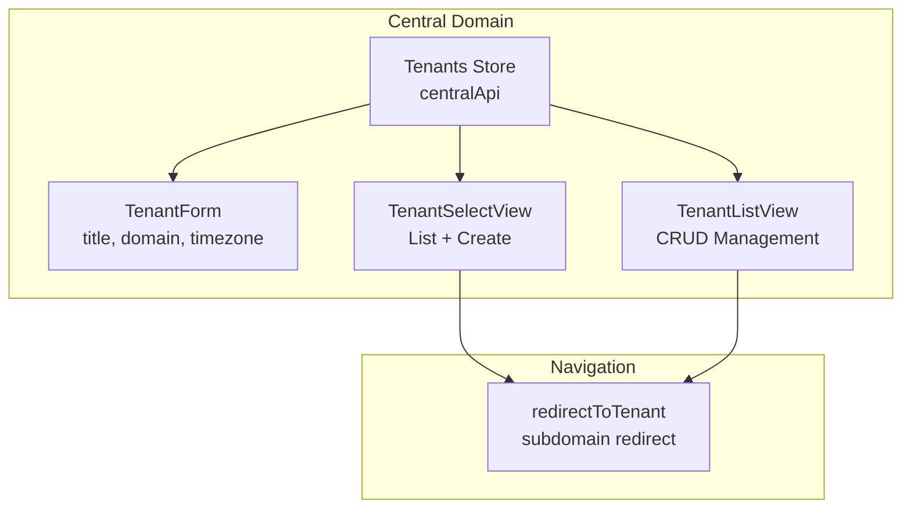

# План реализации: T

enant Management & Selection

## Обзор

Реализация функционала управления тенантами включает создание Pinia store для CRUD операций через центральный API, форму создания/редактирования, обновление TenantSelectView с интеграцией создания тенанта, и TenantListView для управления тенантами в центральном режиме.

## Архитектура




## Этап 1: Tenants Store

**Файл:** `src/stores/core/tenants.ts`Создать Pinia store по аналогии с `src/stores/workspace/clients.ts`, но:

- Использовать `centralApi` вместо `tenantApi`
- Endpoint: `/v1/tenants` (без префикса workspace)
- State: `byId`, `lists`, `currentTenant`, `loading`, `error`
- Actions:
- `fetchTenants()` - GET /v1/tenants
- `fetchTenant(id)` - GET /v1/tenants/{id}
- `createTenant(data: TenantCreateDTO)` - POST /v1/tenants
- `updateTenant(id, data: TenantUpdateDTO)` - PUT /v1/tenants/{id}
- `deleteTenant(id)` - DELETE /v1/tenants/{id}
- Getters: `tenants` (computed из byId)

**DTO типы:**

```typescript
interface TenantCreateDTO {
  title: string
  domain: string
  timezone?: string
}

interface TenantUpdateDTO {
  title?: string
  timezone?: string
}
```

**Особенности:**

- Обработка ошибок валидации (422) для domain uniqueness
- Toast уведомления через `useUiStore`
- После создания/обновления - обновление кэша

## Этап 2: Tenant Form Component

**Файл:** `src/features/tenants/components/TenantForm.vue`Создать форму по аналогии с `src/features/workspace/components/ProjectForm.vue`:**Поля:**

- `title` (required, Input) - название workspace
- `domain` (required, Input) - subdomain
- `timezone` (optional, Select или Input) - часовой пояс

**Валидация:**

- title: `required`, `minLength(3)`, `maxLength(255)`
- domain: `required`, `pattern(/^[a-z0-9-]+$/)`, `minLength(2)`, `maxLength(63)`
- timezone: опционально, валидация формата (можно использовать список популярных timezone)

**Использование:**

- `useForm` composable для управления формой
- `FormField` для обертки полей
- `Input`, `Select` компоненты
- Emit: `submit`, `cancel`

**Особенности:**

- Поддержка режима редактирования (через props `tenant`, `isEdit`)
- Валидация domain на клиенте (только латиница, цифры, дефисы)
- Обработка ошибок API (422) для domain uniqueness

## Этап 3: Tenant Select View (обновление)

**Файл:** `src/views/TenantSelectView.vue`Обновить существующий view:**Изменения:**

1. Использовать `useTenantsStore` вместо прямых вызовов API
2. Добавить модальное окно с `TenantForm` для создания нового тенанта
3. После создания - автоматический переход на subdomain через `redirectToTenant()`
4. Если у пользователя только один тенант - автоматический редирект
5. Использовать UI компоненты: `Container`, `PageHeader`, `Card`, `Modal`, `Button`

**Функционал:**

- Загрузка списка через `tenantsStore.fetchTenants()`
- Отображение карточек тенантов (или использовать `Card` компонент)
- Кнопка "Create Workspace" открывает модальное окно
- При клике на тенант - `redirectToTenant(tenant.domain)`
- Обработка пустого состояния (нет тенантов) - показать форму создания

**Интеграция:**

- Использовать `useTenantContextStore` для установки контекста перед редиректом
- Использовать `redirectToTenant()` из `src/core/tenancy/redirect.ts`

## Этап 4: Tenant List View

**Файл:** `src/views/TenantListView.vue`Создать новый view для управления тенантами в центральном режиме:**Структура:**

- `Container` для ограничения ширины
- `PageHeader` с заголовком "Workspaces" и кнопкой "Create Workspace"
- `Table` компонент для списка тенантов
- `Modal` для формы создания/редактирования

**Таблица:**

- Колонки: Title, Domain, Timezone, Created, Actions
- Действия: Edit, Delete, Switch to Tenant (переход на subdomain)
- Пагинация через `meta.paginator` (если поддерживается)

**Функционал:**

- Загрузка списка через `tenantsStore.fetchTenants()`
- Создание тенанта через модальное окно с `TenantForm`
- Редактирование тенанта (открывает модальное окно с заполненной формой)
- Удаление тенанта (с подтверждением)
- Переход на subdomain через `redirectToTenant()`

**Особенности:**

- Доступна только на центральном домене
- После создания/редактирования - обновление списка
- Обработка ошибок с показом toast

## Критические моменты

1. **API Endpoints**: Все запросы через `centralApi` на `/v1/tenants`
2. **Domain Validation**: Валидация domain на уникальность (backend вернет 422)
3. **Subdomain Redirect**: Использовать `redirectToTenant()` из `src/core/tenancy/redirect.ts`
4. **Tenant Context**: Устанавливать контекст через `useTenantContextStore` перед редиректом
5. **Auto-redirect**: Если у пользователя только один тенант - автоматический редирект
6. **Error Handling**: Обработка ошибок валидации domain (422) с показом сообщения

## Порядок реализации

1. **Tenants Store** - основа для всех операций
2. **TenantForm** - компонент формы (используется в обоих views)
3. **TenantSelectView** - обновление существующего view
4. **TenantListView** - новый view для управления

## Зависимости

- UI Components Library ✓
- Forms & Validation ✓